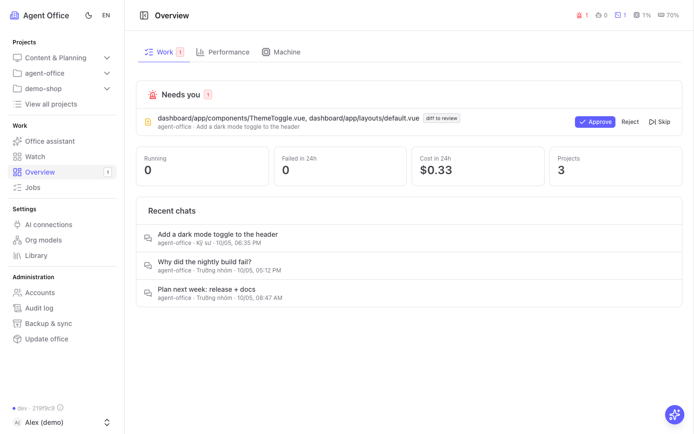
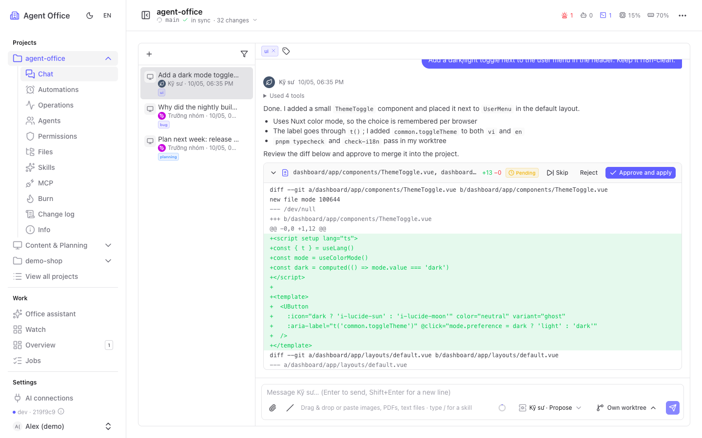
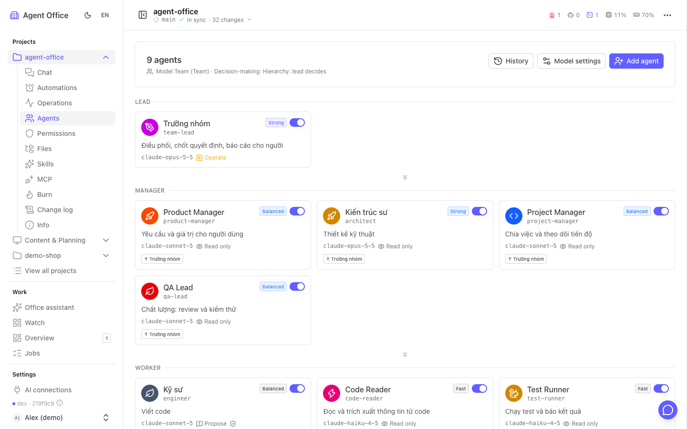
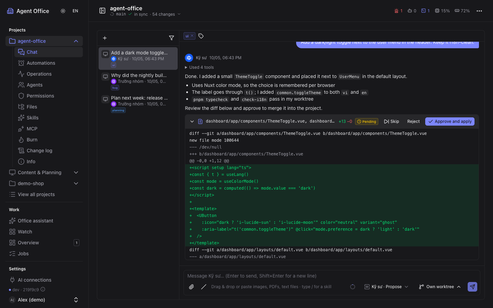
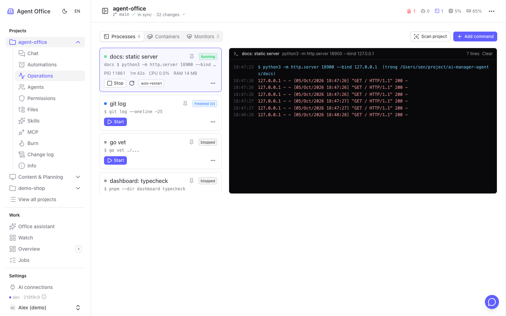
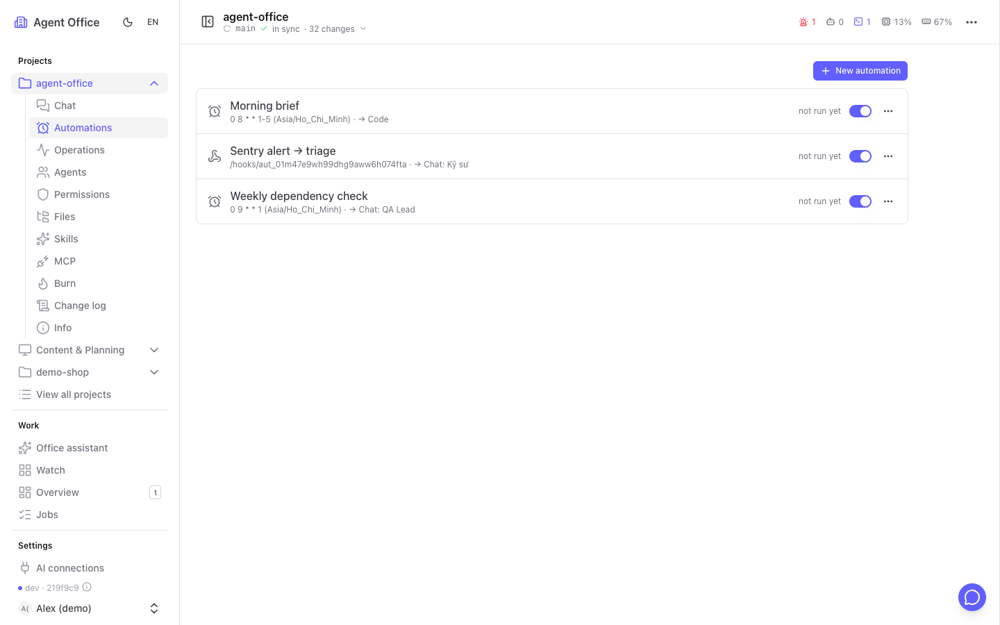
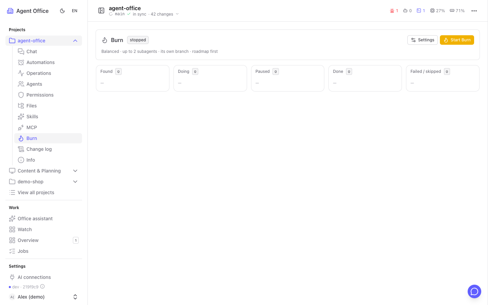
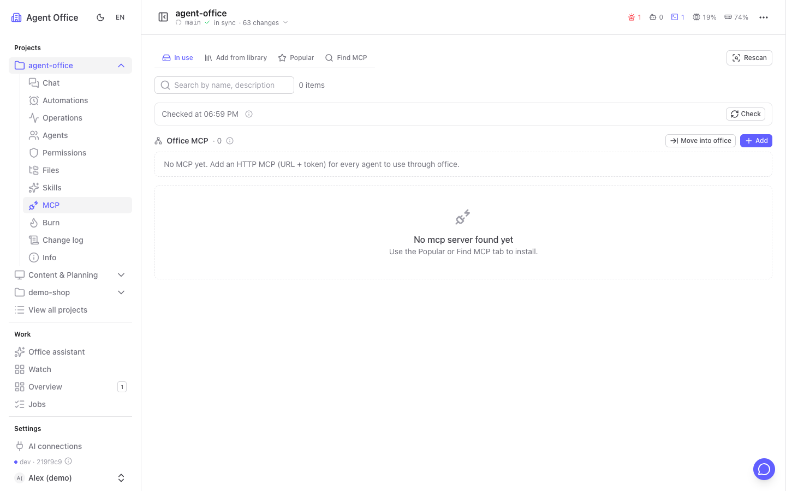
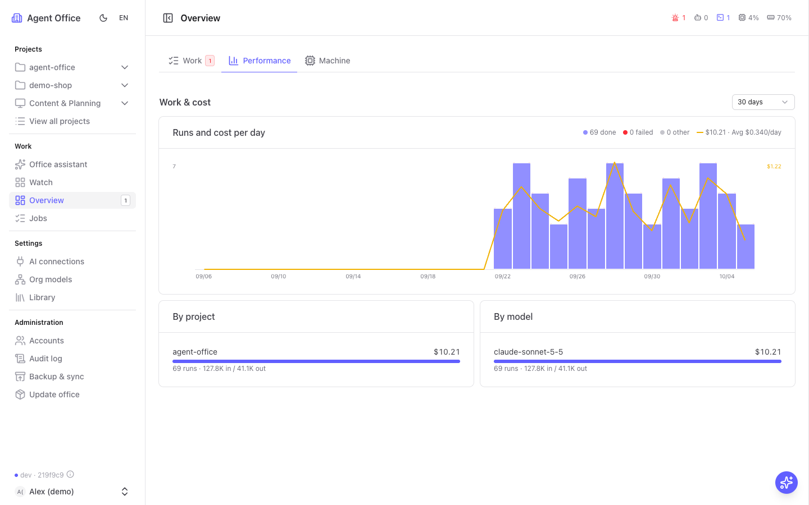
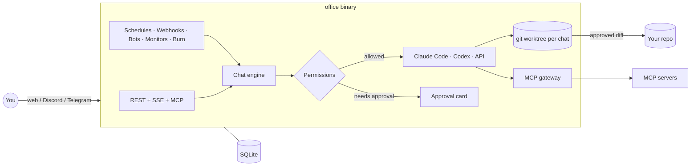

<div align="center">

# agent-office

**Your own AI office. A team of AI agents that runs on your machine, takes work over chat, and asks you only when something needs approval.**

[Guide with screenshots](https://tung1998.github.io/ai-manager-agents/guide/) · [Tiếng Việt](README.vi.md) ([hướng dẫn](https://tung1998.github.io/ai-manager-agents/guide/vi.html))



</div>

---

## Why agent-office

AI coding tools are great one chat at a time. Real work is more than that: several repos, a dev server that crashes at night, a weekly plan, a Discord message from a teammate, a webhook from Sentry. agent-office turns your AI subscriptions into **an office**:

- **A team, not a chatbot.** Each project gets its own agents (lead, developers, QA, reviewer…) organised as Solo, Team, Council (vote + veto) or your own model. They delegate to each other like colleagues.
- **Safe by default.** Every agent edits in its **own git worktree**. Changes come back as a diff that you approve, reject or skip. Permissions are per action (read, edit, run command X, git push, restart container…).
- **Runs where your code runs.** A single Go binary plus a Nuxt dashboard on your machine. It uses the accounts you already have (Claude Code, Codex, Anthropic/OpenAI API or 18+ compatible providers). Your data stays in a local SQLite file.
- **Always on.** Schedules, webhooks, Discord/Telegram bots, uptime monitors and **Burn** (an agent that keeps finding and doing work) keep the office busy while you are away.

| Area | What it does today | Status |
|---|---|---|
| **Code** (priority) | features, bug fixes, PR review, run & monitor dev/build/containers, Burn | used daily on several repos |
| Planning | roadmaps, weekly plans, splitting work | through chat and memory |
| Customer conversations | read and draft replies | Discord/Telegram bots; more via Connectors |
| Content | posts, blogs, docs | through chat; publishing via Connectors (planned) |
| Automation | cron, webhooks, chat messages trigger agents or scripts | used daily |

## Features at a glance

| | |
|---|---|
| 💬 **Chat with your team** · stream, `@mention` agents into a group chat, `/skills`, attach images/PDF/logs, tags, search history |  |
| 🧑‍🤝‍🧑 **Workflows** · type `/giao-lai`, `/co-van`, `/hoi-dong`, `/lam-tinh-nang`… to have several agents work together under rules (roles, access, a different model family, approval gates, votes); write your own by chat |  |
| ✅ **Review before merge** · each chat has a git worktree; diffs, actions and setting changes wait for *Approve / Reject / Skip* (or "approve & always allow") |  |
| ⚙️ **Operations** · detect project commands, run/stop/auto-restart like pm2, live logs, CPU/RAM/ports, docker compose, "ask the agent about this log" |  |
| 🤖 **Automations** · schedule (cron + timezone), webhook, Discord/Telegram message; run a script for free and call an AI only on failure or `@@agent:` |  |
| 🔥 **Burn** · an agent that works on its own in a project, one worktree per task, pause/resume, stop timer |  |
| 🔌 **One MCP gateway** · the office holds MCP servers (HTTP, stdio, OAuth login) and forwards them to every AI with per-tool permissions and a call log |  |
| 💸 **Costs & limits** · every AI call logged with real or estimated cost, daily budgets per office/project/automation, fallback connections when one fails |  |

More: long-term agent memory, office assistant across projects, multi-pane **Watch** screen, change log of who did what and who approved it, Files tab with an editor, users & roles, personal API tokens, export/import config, backup, self-update from source, light/dark, English/Vietnamese.

## An office that upgrades itself

agent-office is a project like any other, so **its own agents can work on it**. Add the agent-office folder as a project and tell the team what your work needs:

> "Add a Zalo OA channel next to Telegram."
> "The Overview should show yesterday's deploys first."
> "Make a monitor type that checks our SSL certificates."

The agents edit the source in their worktree, run the build and tests, and send you the diff. Approve it, then press **Administration → Update office**: the office rebuilds itself from source, restarts, and rolls back on its own if the new build fails to start.

So you don't have to wait for a feature on a roadmap. The office bends to how *you* work, one approved diff at a time.

## Quick start

Requirements: **Go ≥ 1.27**, **Node 22**, **pnpm**, and at least one AI account (Claude Code / Codex CLI logged in, or an API key).

### The AI way 🤖

It's an office run by AI, so it would be rude to set it up by hand. Clone the repo, open your AI in the folder and ask:

```bash
git clone <this repo> agent-office && cd agent-office
claude            # or: codex
```

> **You:** run this project
>
> **AI:** *reads the Makefile, builds the server and the dashboard, starts the office and hands you a link.*

Grab a coffee. If it asks you something, that's the office's first approval request. Get used to it.

### The human way

```bash
git clone <this repo> agent-office && cd agent-office
make build                                        # → bin/office
make ui-install && make ui-build                  # → dashboard/.output
./bin/office run                                  # API :8787 + dashboard http://localhost:2704
```

Open **http://localhost:2704** and sign in with **`admin` / `admin`**. The office asks for your own email and password right away, and the default account can do nothing else until you do. (`office init` asks for the admin email and password up front; press Enter to keep `admin` / `admin`.)

Then follow the checklist on the Overview page:

1. **AI connections** → add Claude Code, Codex, or an API key (test it in one click).
2. **Projects** → add a folder, clone a git URL, or create a folder-less helper.
3. **Starter pack** → pick Solo / Team / Council (agents + installed workflows), or let *Set up with AI* read the repo and propose one.
4. Open the project's **Chat** and give your first task.

Data lives in `~/.agent-office` by default. Use `office init --local` inside a repo to keep the data in `<repo>/.office` instead.

### Run it as a service

```bash
./bin/office service install --now   # LaunchAgent (macOS) / systemd user unit (Linux)
./bin/office service status
```

### Docker

```bash
cp .env.example .env
docker compose up -d --build
docker compose exec office office user create --email you@example.com   # optional: replaces admin / admin
```

Sign in with `admin` / `admin` and set your own, or skip it with the command above. Later accounts are added on the dashboard (Administration → Accounts); `office user passwd --email …` resets a forgotten password.

## How it works



- **One job for every run.** A chat turn, an automation or a monitor analysis is a job with its cost, logs and result.
- **Agents propose, people approve.** Commands outside an agent's allow-list, restarts, commits, pushes, settings changes and MCP tools that write all become cards you decide on, on the dashboard or from a bot message.
- **Office is the only gateway out.** MCP servers, bots and (soon) Connectors go through the office, so permissions and the audit log live in one place.

## CLI

| Command | What it does |
|---|---|
| `office run` | Supervisor: API server + dashboard, restarts on crash, applies self-updates |
| `office serve` | API server only |
| `office init [--local] [--pack team]` | Register the current repo and choose a starter pack |
| `office project add/list/rm` | Manage projects (no path = machine-wide helper) |
| `office provider add/list/test` | AI connections |
| `office user create/list/passwd` | First admin (replaces `admin` / `admin`), list accounts, reset a password |
| `office pack list` | Starter packs (agents + workflows a new project begins with) |
| `office export / import / backup` | Move config between machines, back up the database |
| `office service install/status/uninstall` | Start with your login session |

Run `office <command> --help` for every flag.

## Development

```bash
make dev-api      # API only
make dev-ui       # dashboard with hot reload on :2704
make test         # go test + i18n check
make ui-build     # typecheck + build the dashboard
node docs/guide/capture.mjs   # rebuild the guide screenshots from a throwaway demo office
```

Stack: Go (cobra, net/http, SQLite via `modernc.org/sqlite`, goose migrations), Nuxt 4 + Nuxt UI, SSE for live updates.

```text
cmd/office/        the `office` binary (CLI, supervisor, server)
internal/          api, chat, perm, worktree, automation, trigger, ops, monitor,
                   burn, channels, mcpgateway, memory, storage, …
migrations/        SQLite migrations (goose)
dashboard/         Nuxt 4 dashboard (vi + en)
docs/guide/        the user guide (GitHub Pages)
templates/roles/   role prompts
```

## References

The tools agent-office runs on or talks to, and worth reading to get the most out of it:

| | |
|---|---|
| [Claude Code](https://code.claude.com/docs/en/overview) | Anthropic's agentic coding CLI, the default runtime |
| [Codex CLI](https://github.com/openai/codex) | OpenAI's coding agent, supported as a runtime |
| [Model Context Protocol](https://modelcontextprotocol.io/) | The protocol behind the MCP gateway; servers can be found in the [MCP Registry](https://registry.modelcontextprotocol.io/) |
| [git worktree](https://git-scm.com/docs/git-worktree) | How every chat gets its own copy of the repo |
| [Nuxt UI](https://ui.nuxt.com/) | The component library of the dashboard |
| [goose](https://github.com/pressly/goose) | Database migrations |

## License

[MIT](LICENSE)

---

<sub>agent-office is an independent project built from scratch.</sub>
