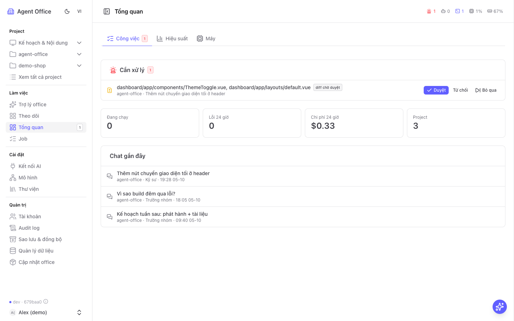
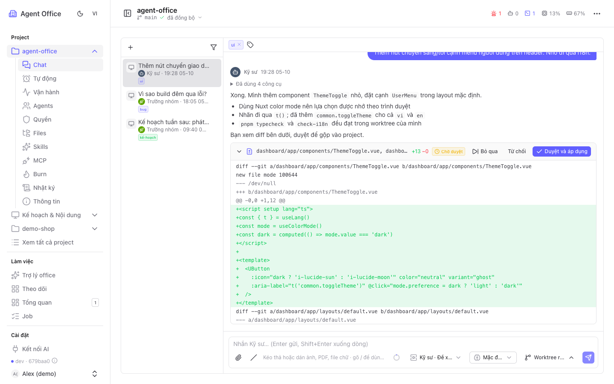
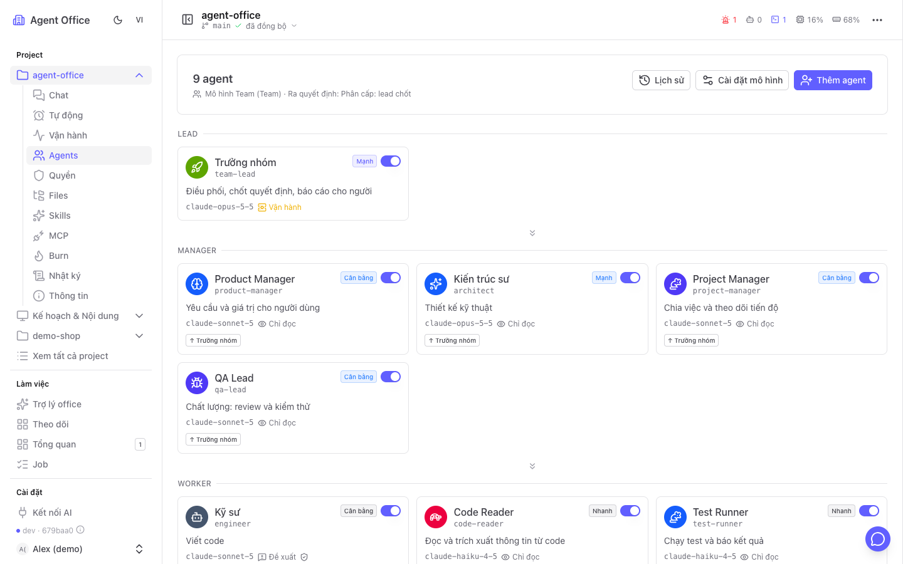
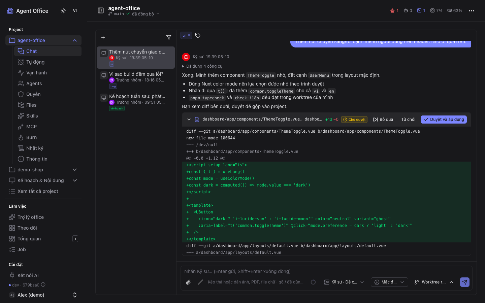
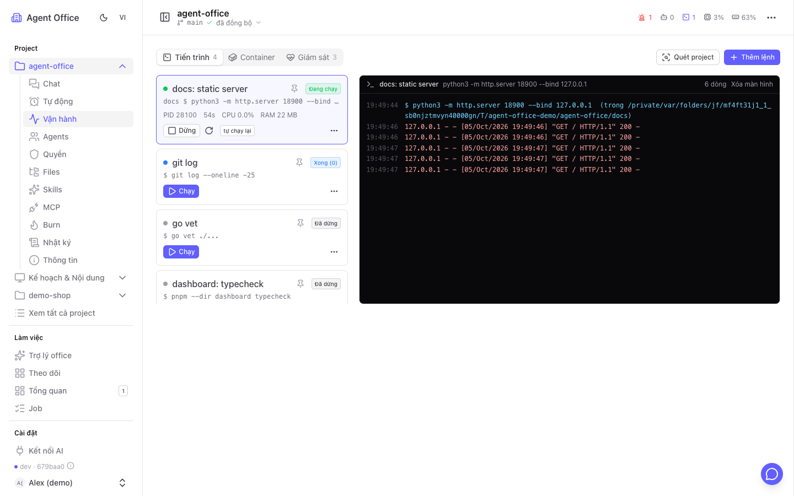
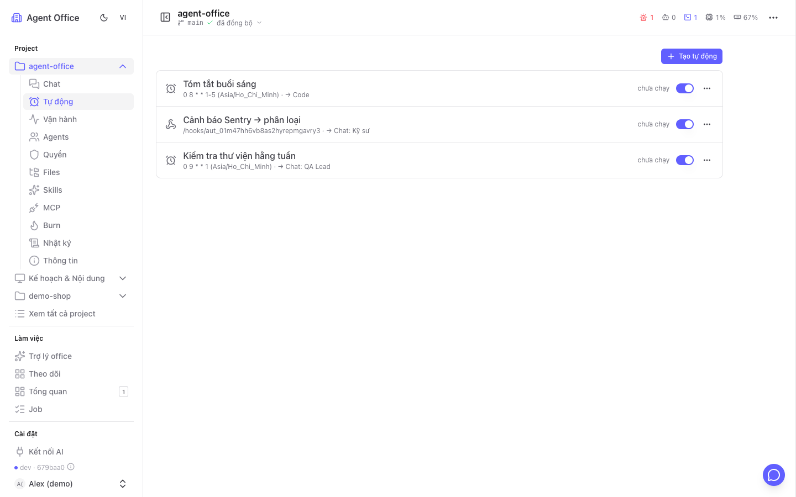
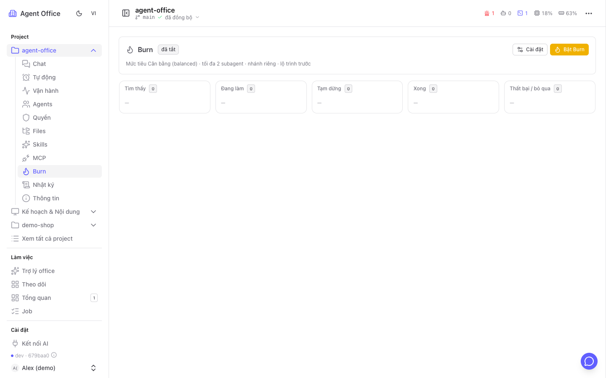
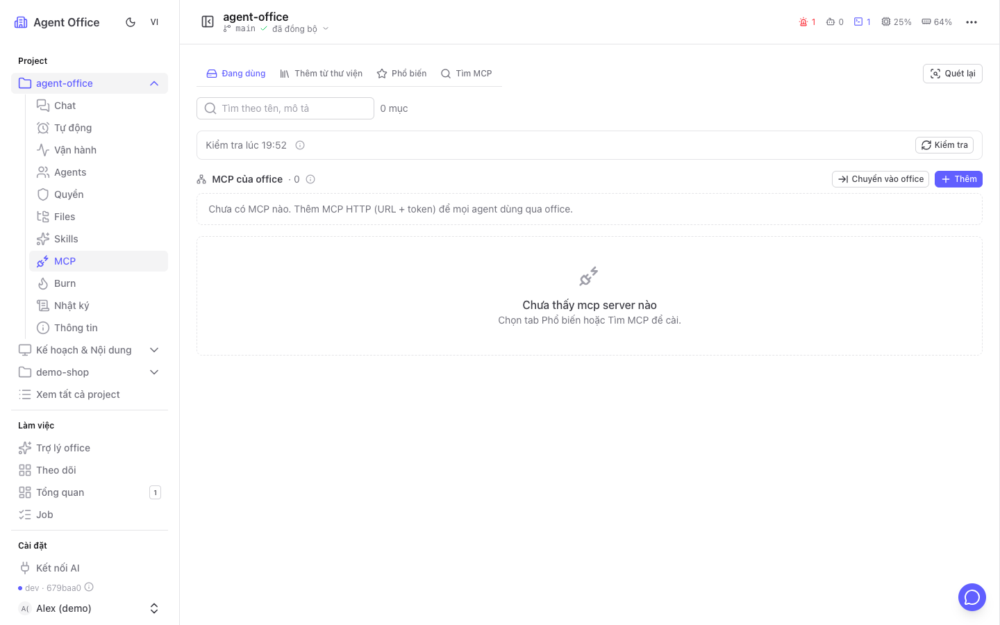
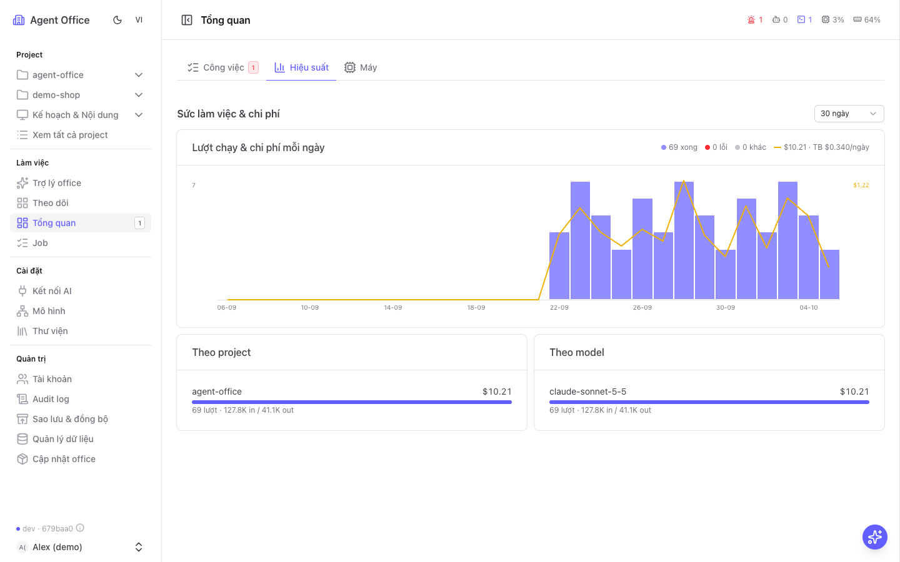
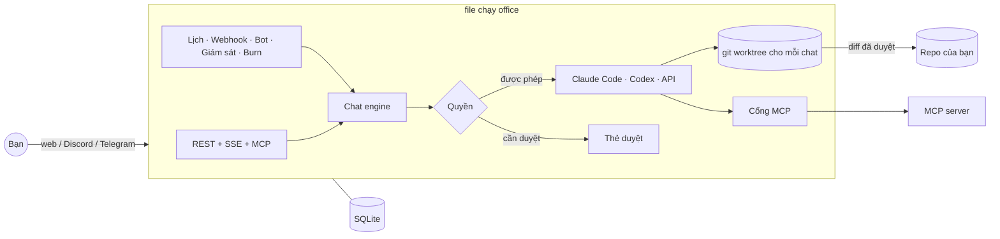

<div align="center">

# agent-office

**Văn phòng AI của riêng bạn. Một đội agent AI chạy trên máy bạn, nhận việc qua chat, và chỉ hỏi bạn khi cần duyệt.**

[Hướng dẫn sử dụng có ảnh](https://tung1998.github.io/ai-manager-agents/guide/vi.html) · [English](README.md) ([guide](https://tung1998.github.io/ai-manager-agents/guide/))



</div>

---

## Vì sao có agent-office

Công cụ AI viết code rất giỏi, nhưng mỗi lần chỉ một cuộc chat. Công việc thật thì nhiều hơn thế: vài repo, một dev server chết lúc nửa đêm, kế hoạch tuần, tin nhắn Discord của đồng nghiệp, webhook từ Sentry. agent-office biến các tài khoản AI bạn đang có thành **một văn phòng**:

- **Một đội, không phải một chatbot.** Mỗi project có các agent riêng (trưởng nhóm, kỹ sư, QA, reviewer…) xếp theo mô hình Solo, Team, Tam quyền (biểu quyết + phủ quyết) hoặc mô hình bạn tự tạo. Họ giao việc cho nhau như đồng nghiệp.
- **An toàn mặc định.** Mỗi agent sửa code trong **git worktree riêng**. Thay đổi quay về dưới dạng diff để bạn duyệt, từ chối hoặc bỏ qua. Quyền đặt theo từng hành động (đọc, sửa, chạy lệnh X, git push, khởi động lại container…).
- **Chạy ngay nơi code của bạn chạy.** Một file chạy Go cùng dashboard Nuxt trên máy bạn. Dùng tài khoản bạn đã có (Claude Code, Codex, API Anthropic/OpenAI hoặc hơn 18 nhà cung cấp tương thích). Dữ liệu nằm trong một file SQLite trên máy.
- **Luôn làm việc.** Lịch chạy, webhook, bot Discord/Telegram, giám sát và **Burn** (agent tự tìm việc và làm) giữ văn phòng chạy cả khi bạn vắng mặt.

| Mảng | Làm được gì | Trạng thái |
|---|---|---|
| **Code** (ưu tiên) | tính năng, sửa lỗi, review PR, chạy và giám sát dev/build/container, Burn | dùng hằng ngày trên nhiều repo |
| Lên kế hoạch | lộ trình, kế hoạch tuần, chia việc | qua chat và trí nhớ |
| Trao đổi khách hàng | đọc và soạn câu trả lời | bot Discord/Telegram; thêm kênh qua Connector |
| Nội dung | bài đăng, blog, tài liệu | qua chat; đăng bài qua Connector (sắp có) |
| Tự động hóa | lịch, webhook, tin nhắn chat kích hoạt agent hoặc script | dùng hằng ngày |

## Tính năng chính

| | |
|---|---|
| 💬 **Chat với cả đội** · trả lời trực tiếp, `@tên` để kéo agent vào nhóm, gọi `/skill`, đính kèm ảnh/PDF/log, tag, tìm lại chat cũ |  |
| 🧑‍🤝‍🧑 **Mô hình tổ chức** · Solo, Team (lập kế hoạch → làm song song → gộp), Tam quyền (biểu quyết, phủ quyết, kiểm tra) hoặc tự tạo; chỉnh từng agent |  |
| ✅ **Duyệt trước khi gộp** · mỗi chat có git worktree riêng; diff, thao tác và đổi cài đặt chờ *Duyệt / Từ chối / Bỏ qua* (hoặc "duyệt & luôn cho phép") |  |
| ⚙️ **Vận hành** · tìm lệnh của project, chạy/dừng/tự chạy lại như pm2, log trực tiếp, CPU/RAM/cổng, docker compose, "hỏi agent về log này" |  |
| 🤖 **Tự động hóa** · lịch (cron + múi giờ), webhook, tin nhắn Discord/Telegram; chạy script miễn phí, chỉ gọi AI khi lỗi hoặc khi gặp `@@agent:` |  |
| 🔥 **Burn** · agent tự làm việc trong project, mỗi việc một worktree, tạm dừng/làm tiếp, hẹn giờ tắt |  |
| 🔌 **Cổng MCP chung** · office giữ các MCP (HTTP, stdio, đăng nhập OAuth) và chuyển tiếp cho mọi AI, có quyền theo từng tool và nhật ký gọi |  |
| 💸 **Chi phí & giới hạn** · mọi lượt gọi AI được ghi lại kèm chi phí thật hoặc ước tính, ngân sách theo ngày cho office/project/tự động hóa, kết nối dự phòng khi một kết nối lỗi |  |

Ngoài ra: trí nhớ dài hạn của agent, trợ lý office dùng chung mọi project, màn **Theo dõi** nhiều khung, nhật ký ai làm gì và ai duyệt, tab Files có trình sửa, tài khoản và vai trò, token cá nhân, xuất/nhập cấu hình, sao lưu, tự cập nhật từ mã nguồn, sáng/tối, tiếng Việt/tiếng Anh.

## Văn phòng tự nâng cấp chính nó

agent-office cũng là một project như mọi project khác, nên **chính các agent của nó sửa được nó**. Thêm thư mục agent-office làm project, rồi nói với đội điều công việc của bạn cần:

> "Thêm kênh Zalo OA bên cạnh Telegram."
> "Trang Tổng quan hiện các lần deploy hôm qua lên đầu."
> "Thêm loại giám sát kiểm tra hạn chứng chỉ SSL."

Agent sửa mã nguồn trong worktree của họ, chạy build và test, rồi gửi bạn diff. Duyệt xong, bấm **Quản trị → Cập nhật office**: office tự build lại từ mã nguồn, khởi động lại, và tự quay về bản cũ nếu bản mới không chạy được.

Bạn không phải chờ tính năng trên lộ trình của ai cả. Văn phòng uốn theo cách *bạn* làm việc, mỗi lần một diff đã duyệt.

## Bắt đầu nhanh

Cần: **Go ≥ 1.27**, **Node 22**, **pnpm**, và ít nhất một tài khoản AI (Claude Code / Codex CLI đã đăng nhập, hoặc một API key).

### Kiểu AI 🤖

Đây là văn phòng do AI vận hành, tự tay cài thì hơi kỳ. Clone repo, mở AI trong thư mục rồi nhờ:

```bash
git clone <repo này> agent-office && cd agent-office
claude            # hoặc: codex
```

> **Bạn:** chạy project này giúp mình
>
> **AI:** *đọc Makefile, build server và dashboard, hỏi email của bạn, tạo tài khoản admin, bật office rồi đưa bạn đường link.*

Đi pha ly cà phê. Nếu AI hỏi gì đó, chúc mừng: đó là yêu cầu duyệt đầu tiên của văn phòng. Rồi bạn sẽ quen thôi.

### Kiểu thủ công

```bash
git clone <repo này> agent-office && cd agent-office
make build                                        # → bin/office
make ui-install && make ui-build                  # → dashboard/.output

./bin/office user create --email ban@example.com --name "Bạn" --role admin
./bin/office run                                  # API :8787 + dashboard http://localhost:2704
```

Mở **http://localhost:2704**, đăng nhập, rồi làm theo checklist trên trang Tổng quan:

1. **Kết nối AI** → thêm Claude Code, Codex hoặc một API key (kiểm tra bằng một cú bấm).
2. **Project** → thêm thư mục, clone link git, hoặc tạo trợ lý không thư mục.
3. **Mô hình tổ chức** → chọn Solo / Team / Tam quyền, hoặc để *Thiết lập bằng AI* đọc repo và đề xuất.
4. Mở **Chat** của project và giao việc đầu tiên.

Dữ liệu mặc định nằm ở `~/.agent-office`. Dùng `office init --local` trong một repo để giữ dữ liệu trong `<repo>/.office`.

### Chạy như một service

```bash
./bin/office service install --now   # LaunchAgent (macOS) / systemd user unit (Linux)
./bin/office service status
```

### Docker

```bash
cp .env.example .env
docker compose up -d --build
docker compose exec office office user create --email ban@example.com --role admin
```

## Cách hoạt động



- **Mọi lần chạy là một job.** Một lượt chat, một tự động hóa hay một lần phân tích giám sát đều là job, có chi phí, log và kết quả.
- **Agent đề xuất, người duyệt.** Lệnh ngoài danh sách cho phép, khởi động lại, commit, push, đổi cài đặt và tool MCP có ghi dữ liệu đều thành thẻ để bạn quyết, trên dashboard hoặc ngay trong tin nhắn bot.
- **Office là cổng duy nhất ra ngoài.** MCP, bot và (sắp tới) Connector đều đi qua office, nên quyền và nhật ký nằm ở một chỗ.

## Lệnh CLI

| Lệnh | Tác dụng |
|---|---|
| `office run` | Supervisor: server API + dashboard, tự bật lại khi dừng, áp dụng bản cập nhật |
| `office serve` | Chỉ chạy server API |
| `office init [--local] [--template team]` | Đăng ký repo hiện tại và chọn mô hình |
| `office project add/list/rm` | Quản lý project (không có path = trợ lý toàn máy) |
| `office provider add/list/test` | Kết nối AI |
| `office user create/list/passwd` | Tài khoản dashboard |
| `office template list` | Mô hình tổ chức có sẵn và tự tạo |
| `office export / import / backup` | Chuyển cấu hình giữa các máy, sao lưu database |
| `office service install/status/uninstall` | Tự bật cùng phiên đăng nhập máy |

Chạy `office <lệnh> --help` để xem mọi tùy chọn.

## Phát triển

```bash
make dev-api      # chỉ API
make dev-ui       # dashboard có hot reload ở :2704
make test         # go test + kiểm tra i18n
make ui-build     # typecheck + build dashboard
node docs/guide/capture.mjs --lang=vi   # chụp lại ảnh hướng dẫn từ một office demo tạm
```

Stack: Go (cobra, net/http, SQLite qua `modernc.org/sqlite`, migration goose), Nuxt 4 + Nuxt UI, SSE để cập nhật trực tiếp.

```text
cmd/office/        file chạy `office` (CLI, supervisor, server)
internal/          api, chat, perm, worktree, automation, trigger, ops, monitor,
                   burn, channels, mcpgateway, memory, storage, …
migrations/        migration SQLite (goose)
dashboard/         dashboard Nuxt 4 (vi + en)
docs/guide/        hướng dẫn sử dụng (GitHub Pages)
templates/roles/   prompt theo vai trò
```

---

<sub>agent-office là dự án độc lập, xây từ đầu.</sub>
