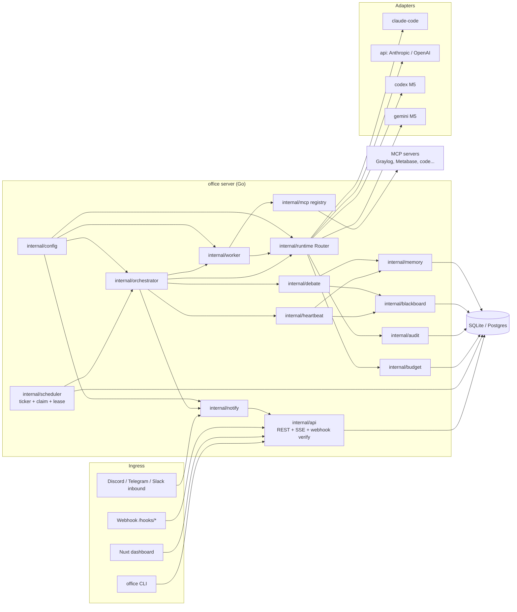
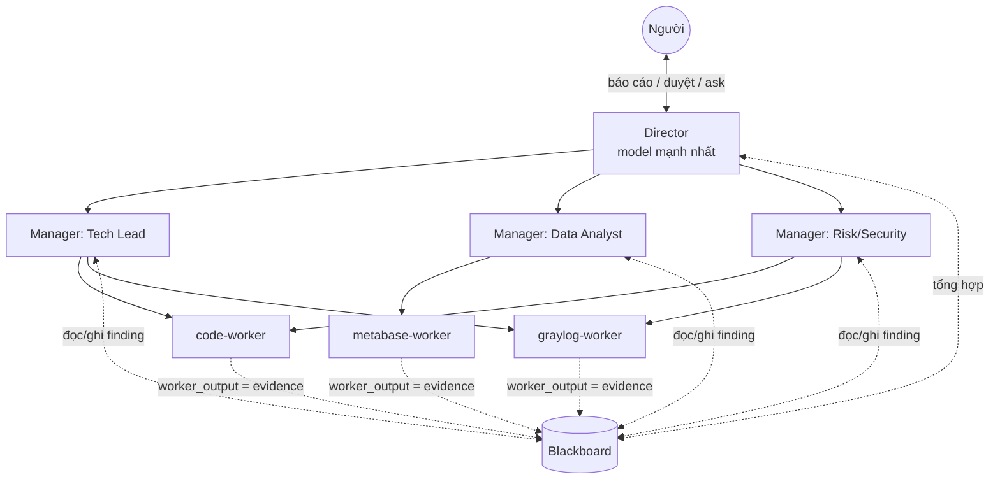
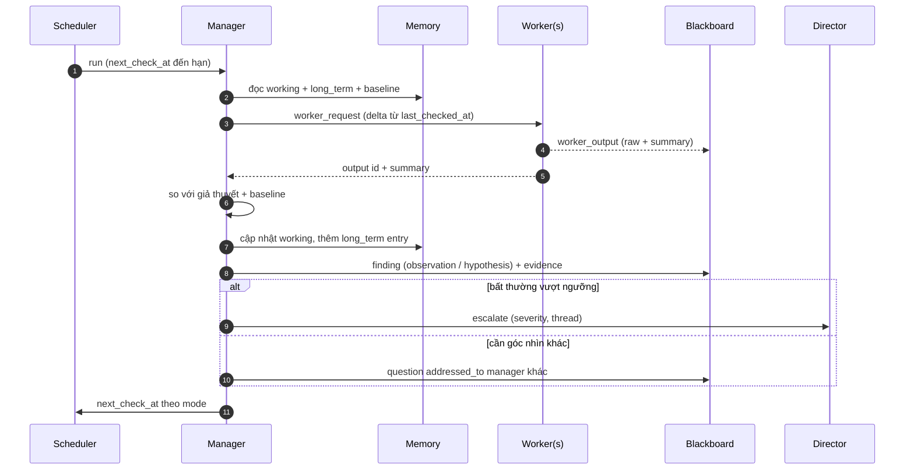
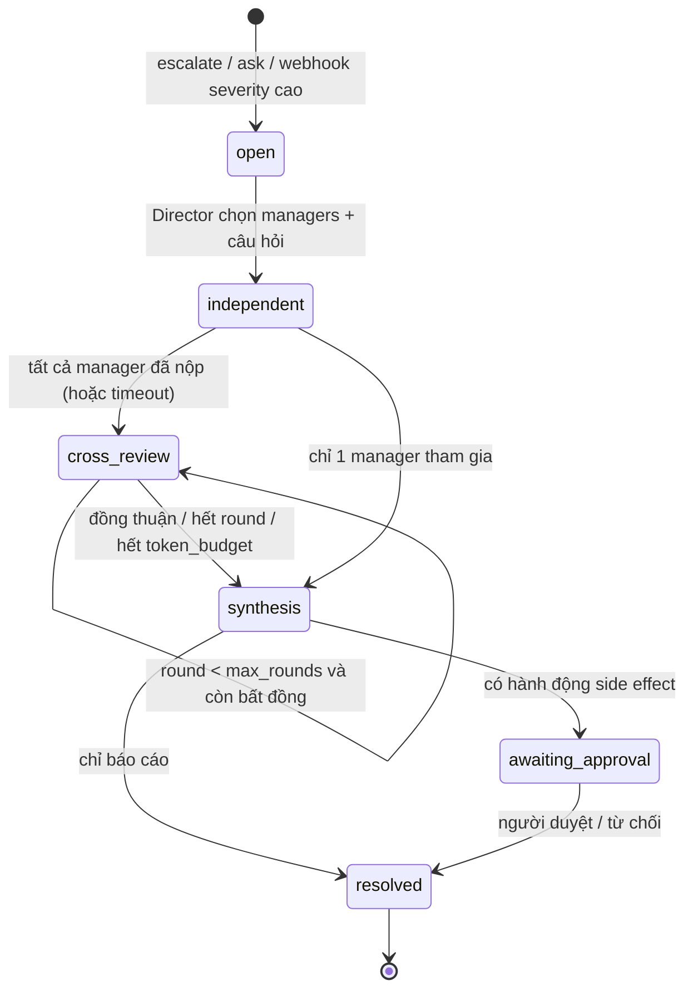
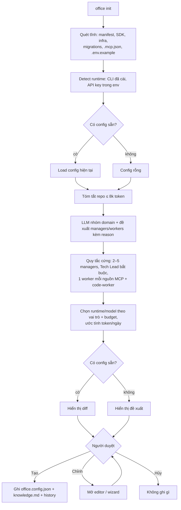

# Kiến trúc agent-office

## 1. Thành phần

| Thành phần | Trách nhiệm | Không làm |
|---|---|---|
| `config` | Load/validate/ghi `office.config.json`, resolve secret từ env, diff | Lưu secret |
| `api` | REST + SSE cho UI, webhook ingress (verify, dedupe vào `events`) | Logic nghiệp vụ |
| `scheduler` | Poll `schedules` và `events`, enqueue `runs`, claim có lease, reset khi restart | Gọi LLM |
| `orchestrator` | Chạy một run: dựng prompt, gọi Router, parse output, quyết định escalate/notify | Gọi tool dữ liệu |
| `heartbeat` | Vòng 6 bước của manager, tính `next_check_at` | |
| `debate` | State machine incident: independent → cross_review → synthesis | |
| `blackboard` | Threads + findings, enforce evidence | |
| `memory` | 3 lớp, entries, compaction, baseline | |
| `worker` | Strict MCP config, verify tool surface, validate + lưu output | Kết luận |
| `runtime` | Adapter interface, Router, fallback, envelope | |
| `budget` | Kiểm tra trước khi chạy, ghi ledger, auto-disable | |
| `audit` | Log append-only mọi run và hành động người duyệt | |
| `notify` | Gửi/nhận tin theo kênh, router theo severity | Quyết định có gửi hay không |
| `mcp` | Registry, probe, phân loại read-only theo annotation | |
| `initscan` | Quét tĩnh repo, detect runtime | |

## 2. Tổ chức agent

- Một worker có thể phục vụ nhiều manager. Gán qua `managers[].workers[]` trong config.
- Manager không gọi nhau trực tiếp. Hỏi nhau bằng finding loại `question` có `addressed_to`, orchestrator enqueue run cho manager được hỏi.
- Director là agent duy nhất nói chuyện với người (qua notify router).

## 3. Luồng một run

1. Trigger tạo dòng `runs` (`pending`) với `trigger` = `schedule|cron|event|ask|debate|worker_request|compaction`.
2. Scheduler claim, đặt `lease_until`. Budget guard kiểm tra trước. Hết budget thì run `skipped` kèm lý do.
3. Orchestrator dựng prompt theo thứ tự cố định:
   1. Role template (system)
   2. Project knowledge (`knowledge.md`)
   3. Memory của agent (working, long_term tóm tắt, baseline)
   4. Context của run: delta data, finding liên quan, câu hỏi
   5. Dữ liệu tool bọc trong `<tool_data source=… id=…>`
   6. Output schema
4. Router chọn adapter, fallback nếu lỗi hạ tầng. Adapter stream event về `run_events` (SSE cho UI).
5. Orchestrator validate output theo JSON Schema của vai trò. Sai schema thì retry một lần với thông báo lỗi, rồi `failed` với `failure_class=output_contract`.
6. Áp dụng output: ghi finding, cập nhật memory, enqueue worker request, escalate, đặt `next_check_at`.
7. Ghi `cost_ledger`, audit, đóng run.

## 4. Vòng heartbeat

Heartbeat chia 2 run để tiết kiệm token: **plan run** (đọc memory, quyết định cần dữ liệu gì) và **analyze run** (nhận worker output, kết luận bước). Nếu memory nói không cần dữ liệu mới, chỉ có plan run.

**Tần suất thích ứng.** Manager đề xuất `next_check_in`. Orchestrator kẹp vào khoảng của mode trong config.

| Mode | Khoảng mặc định | Vào mode khi |
|---|---|---|
| normal | 30–120 phút | Không có tín hiệu lệch baseline |
| suspicious | 5–15 phút | Giả thuyết mở có confidence ≥ 0.4 hoặc lệch baseline > 2σ |
| incident | 2–5 phút | Director mở incident có manager này tham gia |

Mode tự hạ về normal sau `cooldown_checks` lần check sạch liên tiếp.

## 5. Debate flow

- **independent.** Mỗi manager nhận câu hỏi + evidence chung, **không** nhận finding của manager khác (blackboard lọc theo `round=0` và `author`). Mỗi manager có thể yêu cầu worker thêm dữ liệu.
- **cross_review.** Mỗi manager đọc toàn bộ finding round trước, viết `rebuttal` hoặc ủng hộ kèm evidence. Đồng thuận khi không còn rebuttal mới có confidence ≥ 0.5.
- **synthesis.** Director đọc toàn thread, viết `conclusion`: kết luận, phương án (có/không side effect), mức tự tin, rủi ro, câu hỏi còn mở. Evidence bắt buộc.
- **Giới hạn.** `debate.max_rounds` (mặc định 2), `debate.token_budget` và `budget.per_incident_usd`. Chạm giới hạn thì chuyển thẳng synthesis với cờ `truncated=true`.

## 6. Luồng `office init`

`--static` bỏ qua bước G–H (M0). Nguồn chưa có MCP được liệt kê trong mục `suggested_connections`, không tạo worker.

## 7. Trigger

| Loại | Nguồn | Tạo run |
|---|---|---|
| schedule | `schedules.next_check_at` | heartbeat plan run |
| cron | `schedules.cron` (VD báo cáo sáng) | Director report run |
| event | `POST /hooks/{source}` đã verify, dedupe, debounce | Director triage run |
| on-demand | `office ask`, UI, tin nhắn chat | Director ask run |
| internal | worker_request, question, compaction, debate step | run tương ứng |

## 8. Bảo mật

- Worker read-only mặc định, strict MCP, verify tool surface (ADR-009).
- Dữ liệu tool là data: bọc `<tool_data>`, role template nhắc rõ, không nội suy dữ liệu vào phần instruction.
- Agent không có tool gửi tin hay sửa dữ liệu (ADR-008).
- Webhook verify HMAC/token, fail-closed khi thiếu secret.
- API dashboard bind `127.0.0.1` mặc định, token bắt buộc khi bind ra ngoài.
- Audit log append-only cho mọi run, approval và thay đổi config.

## 9. Quan sát

- Mỗi run: agent, trigger, runtime, model, fallback_index, token (fresh/cache read/cache write/output), cost, duration, status, failure_class.
- `run_events` stream cho UI. `office status` và màn Chi phí đọc `cost_ledger`.
- Log có cấu trúc (`log/slog` JSON) ra stdout.

## 10. Mở rộng bằng plugin

Registry compile-time: plugin gọi `runtime.Register`, `notify.Register`, `storage.Register`, `trigger.Register`, `roles.Register` trong `init()`. Binary tùy biến import plugin cần thiết. Chi tiết ở [INTERFACES.md](INTERFACES.md#plugin).
