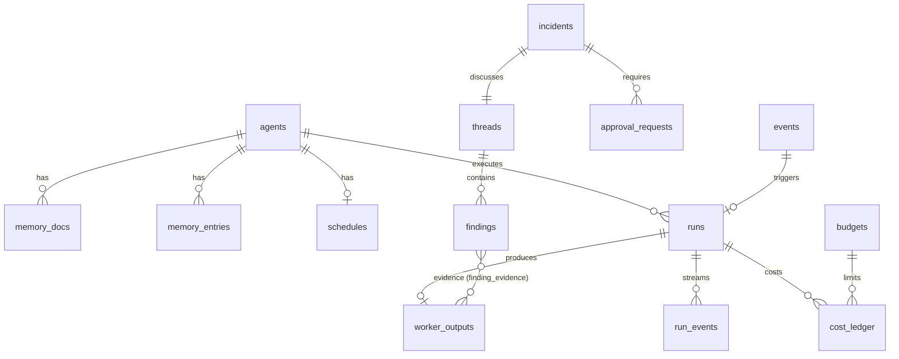

# Data model

Schema logic dùng chung cho SQLite và Postgres. Cột kiểu `json` là `jsonb` trên Postgres và `TEXT` (JSON hợp lệ, kiểm tra bằng `json_valid`) trên SQLite. `id` là ULID dạng text để sắp theo thời gian và không phụ thuộc sequence. Thời gian lưu UTC, ISO-8601 trên SQLite và `timestamptz` trên Postgres.

## Sơ đồ quan hệ

## Bảng

### `agents`
Mirror của config (ADR-011). Chỉ `office` ghi, khi sync từ file.

| Cột | Kiểu | Ghi chú |
|---|---|---|
| id | text PK | = `id` trong config, VD `tech-lead` |
| level | text | `director` \| `manager` \| `worker` |
| role | text | tên role template |
| config | json | snapshot khối config của agent |
| config_hash | text | phát hiện thay đổi |
| enabled | bool | |
| disabled_reason | text null | `budget_daily` \| `failures` \| `manual` |
| disabled_at | ts null | |
| consecutive_failures | int | kill-switch |
| created_at, updated_at | ts | |

### `memory_docs`
Ba document mỗi manager/director (ADR-006). Mỗi lần ghi tạo version mới, không update tại chỗ.

| Cột | Kiểu | Ghi chú |
|---|---|---|
| id | text PK | |
| agent_id | text FK | |
| layer | text | `working` \| `long_term` \| `baseline` |
| version | int | tăng dần theo (agent_id, layer) |
| content | json | theo schema của layer, xem dưới |
| char_count | int | để kích hoạt compaction |
| source | text | `heartbeat` \| `compaction` \| `learn` \| `manual` |
| compacted_from | json null | danh sách `memory_entries.id` đã gộp |
| run_id | text null | run tạo ra version |
| created_at | ts | |

Unique `(agent_id, layer, version)`. Bản hiện hành = version lớn nhất.

**Schema content theo layer.**
- `working`: `{ mode, hypotheses: [{id, text, confidence, evidence_ids, opened_at}], open_questions: [], watchlist: [], last_checked_at, next_check_at, notes }`
- `long_term`: `{ summary, patterns: [{text, first_seen, last_seen, count}], past_incidents: [{incident_id, lesson}], noise: [{signature, reason}] }`
- `baseline`: `{ metrics: [{key, window, median, p95, stddev, by_hour?: {}, sample_size, computed_at}], interpretation }`

### `memory_entries`
Mục long_term được append trước khi compaction gộp vào document.

| Cột | Kiểu | Ghi chú |
|---|---|---|
| id | text PK | |
| agent_id | text FK | |
| kind | text | `pattern` \| `lesson` \| `noise` \| `fact` |
| text | text | |
| refs | json | id finding/incident/worker_output liên quan |
| superseded_by | text null | id version `memory_docs` đã gộp entry này |
| created_at | ts | |

### `schedules`

| Cột | Kiểu | Ghi chú |
|---|---|---|
| id | text PK | |
| agent_id | text FK | |
| kind | text | `heartbeat` \| `cron` |
| cron | text null | 5 trường, dùng khi `kind=cron` |
| timezone | text | |
| mode | text | `normal` \| `suspicious` \| `incident` |
| next_check_at | ts | index |
| last_checked_at | ts null | mốc delta cho worker |
| clean_streak | int | đếm để hạ mode |
| task | text null | nội dung run cron, VD `morning_report` |
| enabled | bool | |

### `events`
Inbox webhook và tin nhắn inbound, dedupe + debounce.

| Cột | Kiểu | Ghi chú |
|---|---|---|
| id | text PK | |
| source | text | `sentry` \| `graylog` \| `discord` \| … |
| dedupe_key | text | unique trong cửa sổ `dedupe_ttl` |
| payload | json | đã verify, raw giữ nguyên |
| severity | text null | map từ source |
| status | text | `received` \| `debounced` \| `dispatched` \| `ignored` |
| process_after | ts | debounce |
| run_id | text null | run được tạo |
| received_at | ts | |

### `runs`
Queue kiêm lịch sử và audit (ADR-004).

| Cột | Kiểu | Ghi chú |
|---|---|---|
| id | text PK | |
| agent_id | text FK | |
| parent_run_id | text null | VD analyze run → plan run |
| trigger | text | `schedule` \| `cron` \| `event` \| `ask` \| `debate` \| `worker_request` \| `question` \| `compaction` |
| thread_id, incident_id | text null | |
| status | text | `pending` \| `running` \| `done` \| `failed` \| `skipped` \| `cancelled` |
| priority | int | incident > ask > schedule |
| attempt, max_attempts | int | |
| available_at | ts | retry backoff, debounce |
| lease_until | ts null | worker giữ run |
| input | json | context đầu vào (tham chiếu, không nhét raw lớn) |
| prompt_hash | text | để so sánh, không lưu prompt đầy đủ mặc định |
| output | json null | output đã validate |
| error, failure_class | text null | `runtime_unavailable` \| `quota` \| `timeout` \| `output_contract` \| `tool_surface` \| `budget` \| `internal` |
| runtime_used, model_used | text null | |
| fallback_index | int | 0 = runtime chính |
| session_id | text null | |
| input_tokens, cache_read_tokens, cache_write_tokens, output_tokens | int | |
| cost_usd | numeric | |
| cost_estimated | bool | |
| num_turns | int | |
| created_at, started_at, finished_at | ts | |

Index `(status, available_at, priority)`. Claim: Postgres `FOR UPDATE SKIP LOCKED`, SQLite `UPDATE … WHERE id = (SELECT … LIMIT 1) RETURNING *` trong `BEGIN IMMEDIATE`.

### `run_events`
Stream event từ adapter, giới hạn 1000 dòng mỗi run.

| Cột | Kiểu | Ghi chú |
|---|---|---|
| run_id | text FK | |
| seq | int | PK cùng run_id |
| type | text | `text` \| `tool_call` \| `tool_result` \| `system` \| `error` |
| data | json | cắt ở 8 KB |
| at | ts | |

### `worker_outputs`
Output chuẩn của worker, là **evidence** duy nhất hợp lệ.

| Cột | Kiểu | Ghi chú |
|---|---|---|
| id | text PK | |
| request_id | text | id yêu cầu từ manager, unique |
| run_id | text FK | |
| worker_id | text FK | |
| requested_by | text | agent id manager/director |
| query | text | câu hỏi/tham số đã chuẩn hóa |
| source | json | `{server, tool, args}` |
| data | json | dữ liệu có cấu trúc đã cắt gọn |
| raw_ref | text | `db:<blob_id>` hoặc `file:.office/blobs/<id>` |
| raw_bytes | int | |
| summary | text | tối đa 500 ký tự, không kết luận |
| delta_from, delta_to | ts null | khoảng dữ liệu |
| timestamp | ts | thời điểm lấy |

### `blobs`
| Cột | Kiểu | Ghi chú |
|---|---|---|
| id | text PK | |
| content | bytea / blob | ≤ 1 MB, gzip |
| sha256 | text | dedupe |

### `threads`

| Cột | Kiểu | Ghi chú |
|---|---|---|
| id | text PK | |
| title | text | |
| origin | text | `heartbeat` \| `event` \| `ask` \| `report` |
| status | text | `open` \| `debating` \| `closed` |
| debate_phase | text null | `independent` \| `cross_review` \| `synthesis` |
| round | int | |
| created_by | text | agent id hoặc `human:<name>` |
| created_at, closed_at | ts | |

### `findings`

| Cột | Kiểu | Ghi chú |
|---|---|---|
| id | text PK | |
| thread_id | text FK | |
| author | text | agent id |
| kind | text | `observation` \| `hypothesis` \| `question` \| `rebuttal` \| `conclusion` |
| round | int | 0 = independent |
| body | text | markdown ngắn |
| confidence | real | 0..1, bắt buộc trừ `question` |
| reply_to | text null | finding bị phản biện/trả lời |
| addressed_to | text null | cho `question` |
| severity | text null | `info` \| `low` \| `medium` \| `high` \| `critical` |
| run_id | text FK | |
| created_at | ts | |

### `finding_evidence`
| Cột | Kiểu | Ghi chú |
|---|---|---|
| finding_id | text FK | PK cùng worker_output_id |
| worker_output_id | text FK | |
| note | text null | trích đoạn liên quan |

Ràng buộc evidence (ADR-007) enforce ở `blackboard.Post` trong transaction: `kind in (observation, hypothesis, rebuttal, conclusion)` phải có ≥ 1 dòng ở đây.

### `incidents`

| Cột | Kiểu | Ghi chú |
|---|---|---|
| id | text PK | |
| thread_id | text FK unique | |
| title | text | |
| severity | text | |
| status | text | `open` \| `debating` \| `awaiting_approval` \| `resolved` \| `dismissed` |
| participants | json | agent ids |
| conclusion_finding_id | text null | |
| summary | text null | tóm tắt cho người |
| options | json null | `[{id, title, description, side_effect: bool, risk, approval_request_id?}]` |
| confidence | real null | |
| risks | json null | |
| truncated | bool | debate bị cắt do giới hạn |
| token_used, cost_usd | int, numeric | |
| opened_at, resolved_at | ts | |

### `approval_requests`

| Cột | Kiểu | Ghi chú |
|---|---|---|
| id | text PK | |
| incident_id | text FK null | |
| requested_by | text | agent id |
| action | json | `{worker_id, tool, args, description}` |
| status | text | `pending` \| `approved` \| `rejected` \| `expired` \| `executed` \| `failed` |
| decided_by | text null | người duyệt |
| decision_note | text null | |
| expires_at | ts | |
| executed_run_id | text null | |
| created_at, decided_at | ts | |

### `budgets`

| Cột | Kiểu | Ghi chú |
|---|---|---|
| scope | text | `org` \| `agent` \| `incident` |
| scope_id | text | `*` cho org |
| period | text | `day` \| `incident` |
| limit_usd | numeric | |
| max_runs_per_hour | int null | |
| action_on_exceed | text | `skip` \| `disable` \| `downgrade_model` |

PK `(scope, scope_id, period)`. Sinh từ config khi sync: `budget.*` cho scope `org`/`incident`, `rules.daily_cost_limit_usd` và `rules.max_runs_per_hour` của từng agent cho scope `agent`.

### `cost_ledger`

| Cột | Kiểu | Ghi chú |
|---|---|---|
| id | text PK | |
| day | date | theo timezone project |
| agent_id | text | |
| incident_id | text null | |
| run_id | text FK | |
| runtime, model | text | |
| input_tokens, cache_read_tokens, cache_write_tokens, output_tokens | int | |
| cost_usd | numeric | |
| cost_estimated | bool | |

Index `(day, agent_id)`, `(incident_id)`. View `cost_daily` group theo `day, agent_id` cho UI.

### `users`
| Cột | Kiểu | Ghi chú |
|---|---|---|
| id | text PK | `usr_<ulid>` |
| email | text unique | lowercase, so sánh không phân biệt hoa thường |
| name | text | |
| role | text | `admin` \| `member` |
| password_hash | text | argon2id encoded |
| disabled | bool | |
| created_at, updated_at, last_login_at | ts | |

### `sessions`
| Cột | Kiểu | Ghi chú |
|---|---|---|
| id | text PK | `ses_<ulid>` |
| user_id | text FK | cascade delete |
| token_hash | text unique | SHA-256 của token, không lưu token gốc |
| created_at, expires_at, last_seen_at | ts | TTL 7 ngày, idle 24 giờ |
| user_agent, ip | text | |

### `providers`
| Cột | Kiểu | Ghi chú |
|---|---|---|
| id | text PK | `prv_<ulid>` |
| name | text unique | |
| kind | text | `anthropic` \| `openai` \| `openai_compatible` \| `claude_cli` \| `codex_cli` |
| base_url | text | URL API, hoặc đường dẫn binary với CLI |
| api_key_enc | text | AES-256-GCM, không bao giờ trả qua API |
| api_key_env | text | đọc key từ biến môi trường này |
| api_key_hint | text | 4 ký tự cuối |
| tier_models | json | `{strong, balanced, fast}` |
| models | json | danh sách model lần kiểm tra cuối |
| is_default, enabled | bool | |
| status, status_detail, checked_at | text, text, ts | `unknown` \| `ok` \| `error` |

### `repos`
| Cột | Kiểu | Ghi chú |
|---|---|---|
| id | text PK | `rep_<ulid>` |
| name, description | text | tự nhận từ package.json, composer.json, go.mod |
| path | text unique | đường dẫn tuyệt đối trên máy chạy office |
| git_remote | text | đã bỏ thông tin đăng nhập trong URL |

### `org_models`
| Cột | Kiểu | Ghi chú |
|---|---|---|
| id | text PK | `org_<ulid>` |
| repo_id | text FK null | null = mẫu trong thư viện; cascade khi xóa repo |
| source_template_id | text FK null | mẫu gốc khi áp vào repo |
| key | text | unique trong thư viện |
| name, description | text | |
| kind | text | `solo` \| `team` \| `council` \| `custom` |
| governance | json | `{mode: single|hierarchy|council, quorum, veto[], notes}` |
| builtin | bool | mẫu có sẵn, chỉ khôi phục không xóa |

Unique: `key` khi `repo_id IS NULL`; `repo_id` khi khác null (một mô hình mỗi repo).

### `agents`
| Cột | Kiểu | Ghi chú |
|---|---|---|
| id | text PK | `agt_<ulid>` |
| org_model_id | text FK | cascade |
| key | text | unique trong mô hình |
| name, role, description | text | |
| tier | text | `lead` \| `manager` \| `worker` |
| reports_to | json | key của cấp trên trong cùng mô hình |
| provider_id | text FK null | null = kết nối mặc định; set null khi xóa kết nối |
| model_tier | text | `strong` \| `balanced` \| `fast` |
| llm_model | text | model cụ thể, ghi đè hạng |
| instructions | text | system prompt riêng |
| permissions | json | `{read_only, requires_approval, tools[]}` |
| sort | int | |

### `audit_log`

| Cột | Kiểu | Ghi chú |
|---|---|---|
| id | text PK | |
| actor | text | agent id, `human:<name>`, `system` |
| action | text | `run.start`, `run.finish`, `approval.decide`, `config.write`, `agent.disable`, … |
| target | text | |
| detail | json | |
| at | ts | |

Append-only. Không có API update/delete.

## Khác biệt SQLite / Postgres

| Điểm | SQLite | Postgres |
|---|---|---|
| JSON | `TEXT` + `CHECK(json_valid(col))`, truy vấn bằng `json_extract` | `jsonb`, index GIN khi cần |
| Claim queue | `BEGIN IMMEDIATE` + `UPDATE … RETURNING` | `FOR UPDATE SKIP LOCKED` |
| Đồng thời | WAL mode, `busy_timeout=5000`, một writer | Nhiều writer |
| Blob | `BLOB` | `bytea` |
| Numeric cost | `REAL` (đủ cho USD 6 chữ số) | `numeric(12,6)` |
| Realtime UI | poll `run_events` theo seq | có thể dùng `LISTEN/NOTIFY` |

## Retention

- `run_events`: 14 ngày.
- `blobs` của `worker_outputs` không còn được finding tham chiếu: 30 ngày.
- `runs`, `findings`, `incidents`, `cost_ledger`, `audit_log`: giữ vĩnh viễn (dữ liệu cho `tune`/`learn`).
